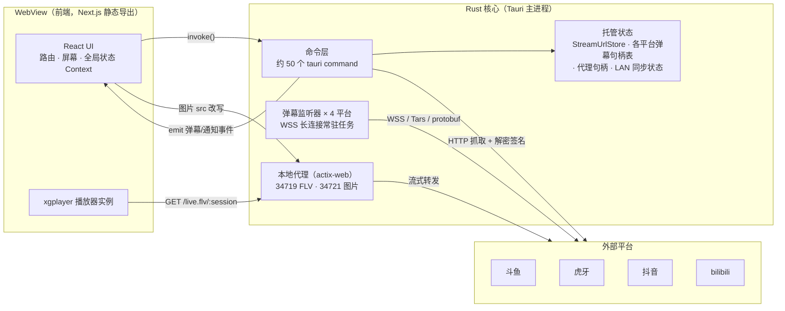
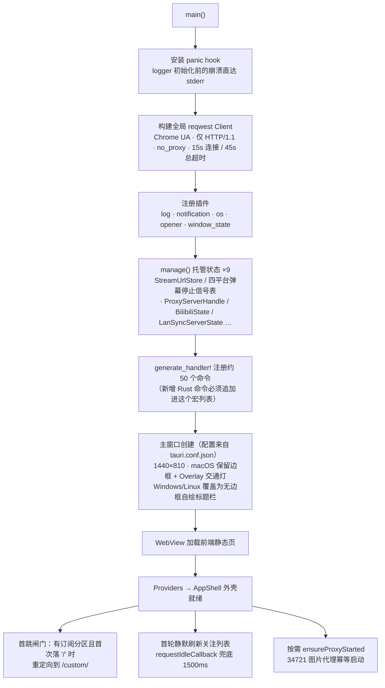
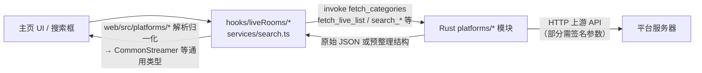
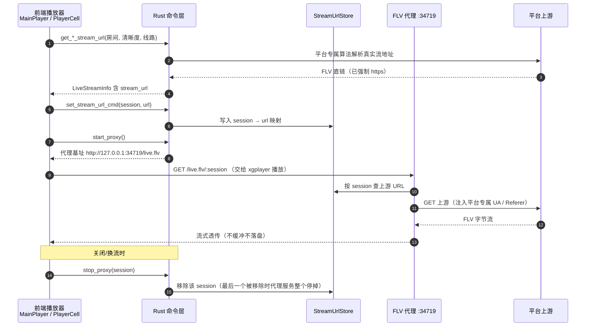
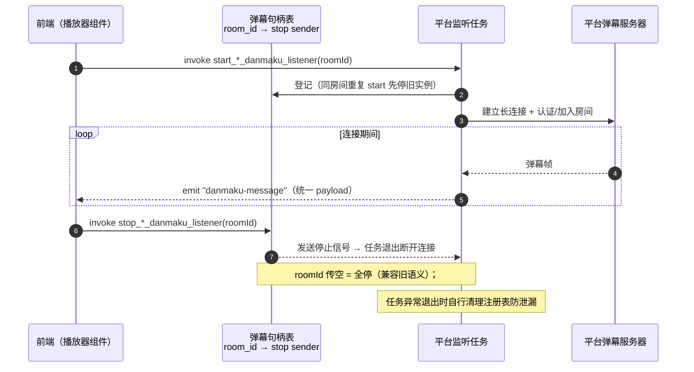
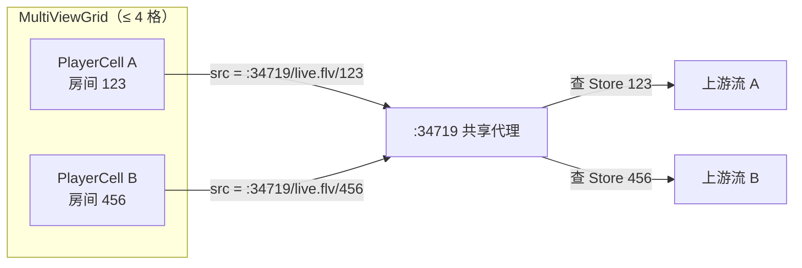
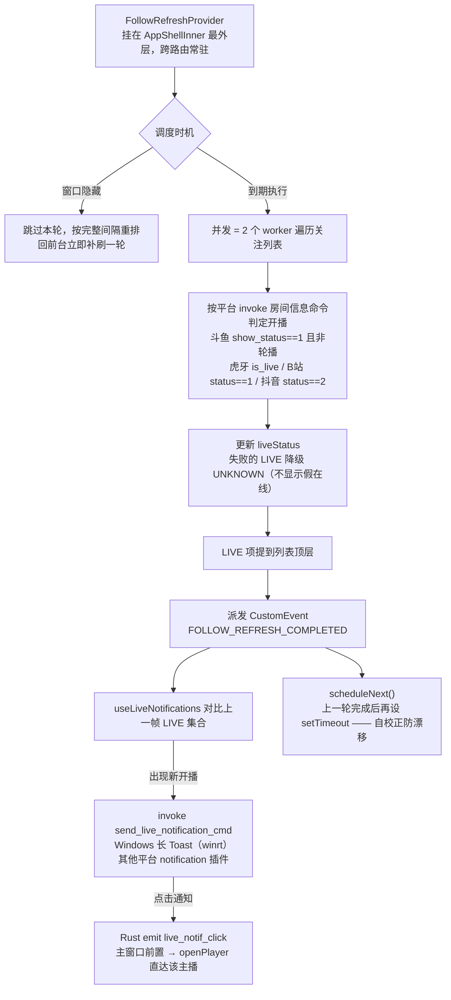
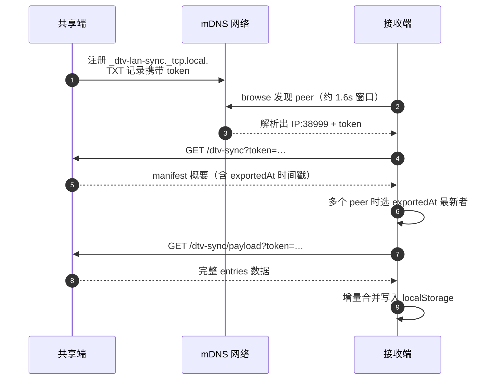
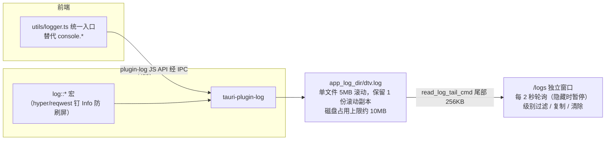

# DTV 工作原理（架构总览）

> 面向想理解本项目运行机制的读者：整体架构、各子系统的数据流与关键设计动机。
> 目录结构与开发协作约定见 [`AGENTS.md`](../AGENTS.md)；多屏布局的细化设计见 [`multiview-layouts.md`](./multiview-layouts.md)。
>
> 撰写基准：2026-08 的 `feat/multiview-layouts` 分支。

## 目录

- [一、总览](#一总览)
- [二、进程模型与启动流程](#二进程模型与启动流程)
- [三、前端结构：路由、屏幕与全局状态](#三前端结构路由屏幕与全局状态)
- [四、平台数据管线：分类、列表与搜索](#四平台数据管线分类列表与搜索)
- [五、直播流播放链路](#五直播流播放链路)
- [六、弹幕系统](#六弹幕系统)
- [七、图片代理](#七图片代理)
- [八、多屏直播](#八多屏直播)
- [九、关注刷新与开播通知](#九关注刷新与开播通知)
- [十、数据同步](#十数据同步)
- [十一、日志系统](#十一日志系统)
- [十二、版本检查](#十二版本检查)
- [十三、构建与分发](#十三构建与分发)
- [附录 A：本地端口速查](#附录-a本地端口速查)
- [附录 B：持久化存储键速查](#附录-b持久化存储键速查)

---

## 一、总览

DTV 是基于 **Tauri 2** 的跨平台直播聚合桌面客户端，聚合斗鱼 / 虎牙 / 抖音 / bilibili 四个平台的直播观看。

架构上是典型的 Tauri 双层模型：

- **Rust 核心**（`src-tauri/`）：平台接口抓取与解密签名（含 deno_core 嵌入式 JS 运行时）、四平台弹幕长连接、两个本地 actix-web 代理、桌面通知、局域网同步、日志落盘等所有「碰网络、碰系统」的事。
- **Web 前端**（`web/`，Next.js 16 静态导出）：跑在系统 WebView 里，负责全部 UI、播放器、全局业务状态与平台 payload 解析。

两条进程间的通信通道：

| 通道 | 方向 | 用途 |
|---|---|---|
| `invoke()` 命令 | 前端 → Rust | 拉取房间信息 / 流地址 / 列表 / 搜索，启停弹幕监听与代理等（约 50 个命令，全部注册在 `src-tauri/src/main.rs` 的 `generate_handler![]`） |
| Tauri 事件 `emit` | Rust → 前端 | 弹幕消息（统一事件 `danmaku-message`）、开播通知点击（`live_notif_click`）等 |
| 本地 HTTP | WebView → Rust 内嵌 actix-web | 媒体字节流（FLV 代理 `:34719`）与防盗链图片（`:34721`）——凡是 WebView 发不出自定义 Header 的场景都走这条路 |



### 技术栈速览

| 层 | 技术 |
|---|---|
| 桌面外壳 | Tauri 2.0，Rust **nightly**（deno_core 依赖 nightly 特性） |
| 前端 | Next.js 16 App Router（`output: "export"` 静态导出）+ React 19 + Tailwind CSS 4 + HeroUI + framer-motion |
| 播放器 | xgplayer 3 + xgplayer-flv（MSE 解 FLV）+ xgplayer-hls.js（B 站）；弹幕渲染用 danmu.js（抖音定制 fork） |
| 嵌入 JS 运行时 | deno_core —— 斗鱼流地址解密脚本、抖音弹幕 WebSocket 签名脚本都在其中执行 |
| 协议库 | tokio-tungstenite（WS）、tars_stream（虎牙 Tars/JCE RPC）、prost + 自编 `.proto`（抖音 protobuf）、brotlic（B 站弹幕解压） |
| 本地服务 | actix-web × 2 实例：`:34719` FLV 流代理（按需起）、`:34721` 图片代理（常驻） |

---

## 二、进程模型与启动流程

入口在 `src-tauri/src/main.rs::main()`。启动链：



几个值得知道的细节：

- **托管状态即全局单例**。`StreamUrlStore`（session → 上游流 URL）、四个平台的弹幕停止信号表（room_id → sender）、`ProxyServerHandle` 等都在 `.manage()` 注册，命令通过 `tauri::State` 注入访问。
- **HTTP 客户端分池**。默认 `reqwest::Client`（Chrome 91 UA）给一般抓取用；`FollowHttpClient` 是独立低并发客户端，专供关注刷新轮询，避免挤占默认连接池。
- **窗口状态记忆**只记 SIZE / POSITION / MAXIMIZED（`tauri_plugin_window_state`），不记其它属性。
- **运行日志窗口是运行时创建的单例 WebviewWindow**（`open_log_window_cmd`，必须是 async 命令——同步命令建窗口会在主线程自死锁导致窗口空白），见[第十一节](#十一日志系统)。

---

## 三、前端结构：路由、屏幕与全局状态

### 3.1 路由 ↔ 屏幕

App Router 页面都是薄包装，实际 UI 在 `web/src/screens/`：

| 路由 | Screen 组件 | 说明 |
|---|---|---|
| `/` | `DouyuHomePage` | 默认首页（斗鱼） |
| `/douyin/` `/huya/` `/bilibili/` | 对应 HomePage | 各平台主页（分类 → 房间列表） |
| `/custom/` | `CustomHomePage` | 用户订阅的自定义分区聚合页 |
| `/player/?platform=&roomId=` | `PlayerPage` | 单房间播放（后备路径，主流入口是 overlay 弹窗） |
| `/logs/` | `LogViewerWindow` | 运行日志独立窗口的内容页 |

两点结构性约定：

- **播放器的主流形态是全屏 overlay 而非路由页**：`PlayerOverlayProvider.openPlayer()` 直接挂载动态加载的 `PlayerPage` 到浮层，Esc 关闭；`/player/` 路由仅作为后备（如直接带参进入）。
- **`/logs/` 是「副窗口」**：`Providers` 检测到该路由时降级为只挂 ThemeProvider（主题跟随主窗口靠 `storage` 事件同步），不挂业务 Provider、无外壳。

### 3.2 Provider 层级

```
TauriIndexHtmlFix
└─ Providers ──────────── /logs/* 降级：仅 ThemeProvider
   ├─ ThemeProvider          主题偏好 theme_preference，写 <html data-theme> + 同步窗口主题
   ├─ FollowProvider         关注列表唯一数据源（主播/文件夹/顺序）
   ├─ PlayerUiProvider       信息岛 / 全屏态 / 窗口置顶 / 弹幕面板回调注册
   └─ CustomCategoriesProvider  订阅的自定义分区
      └─ MotionProvider
         └─ AppShell ─────── /logs/* 直接裸渲染 children（无侧栏无导航）
            └─ PlayerOverlayProvider   全屏浮层播放器开关
               └─ MultiviewProvider    多屏会话态（slots/layout/音频焦点格）
                  └─ VolumeToastProvider
                     └─ AppShellInner
                        └─ FollowRefreshProvider   应用级刷新引擎（见第九节）
                           + Sidebar / Navbar / PlayerOverlayHost / VolumeToastHost
```

层级设计的意图：**越外层的生命周期越长**。刷新引擎和开播通知挂在最内层外壳上，保证不随侧栏折叠、路由切换而卸载；播放器相关的 Provider 在其外，多屏/音量 toast 又在其外，各自的作用域互不牵连。

### 3.3 全局状态的持久化

前端没有后端数据库，所有用户状态都在 localStorage（个别在 sessionStorage），Rust 侧不存业务数据。完整清单见[附录 B](#附录-b持久化存储键速查)。关注列表是三个互相配合的键：`followedStreamers`（主播条目）、`followFolders`（文件夹）、`followListOrder`(展示顺序判别联合，权威来源)，hydration 时互相合并修复。

---

## 四、平台数据管线：分类、列表与搜索

浏览页（分类树、房间列表）和搜索的数据流向四平台同构：



职责切分的两种风格（`web/src/platforms/` 与 `src-tauri/src/platforms/` 目录镜像）：

1. **Rust 返回原始 JSON（或字符串），Web 侧解析类型化**。典型如斗鱼搜索：`search_anchor` 返回原始 JSON *字符串*，前端 `parseDouyuSearch` 做 `JSON.parse`、多候选字段名兜底、type 过滤后才得到结果对象。斗鱼分类也是 Rust 给三级结构、前端 map 成 `Category1[]`。
2. **Rust 预整理成结构体，Web 侧只做字段映射**。如各平台的 `fetch_*_streamer_info` 直接返回 `LiveStreamInfo` 结构，前端 parser 只把 snake_case 映射成内部 `StreamerDetails` 并解释语义（例如抖音 `status===2` 为开播）。

搜索的特殊行为：`filter=all` 时斗鱼/虎牙/B 站并行搜索（`Promise.allSettled`，单平台失败静默）；**抖音没有关键词搜索**，只能输入直播号精确解析单个房间。

---

## 五、直播流播放链路

这是全项目最核心的链路。难点在于：每个平台的流地址都要经过**签名/解密**才能拿到，而且拿到后 WebView 直连会被防盗链拦截（媒体请求无法携带自定义 Referer/UA），所以引入了本地 FLV 代理中转。

### 5.1 四平台流地址解析对比

| 平台 | 解析流程（Rust 侧） | 反爬对抗手段 | 产物 |
|---|---|---|---|
| **斗鱼** | `betard/{rid}` 查房间状态 → `swf_api/homeH5Enc` 拿**加密 JS** → deno_core 里先注入内嵌 cryptojs 再执行该 JS，调用其中的混淆函数得 `sign` 参数 → POST `getH5Play` 两次（第一次拿清晰度/CDN 表，第二次带 rate/cdn 拿地址） | 服务端下发混淆 JS、本地动态执行（这是用 deno_core 的根本原因） | HTTP-FLV |
| **虎牙** | `mp.huya.com profileRoom` 拿各 CDN 候选 → 手工构造 **Tars/TUP 包** POST `wup.huya.com getCdnTokenInfoEx` 拿 flv token → 按 pure_live 算法由 token 盐 + md5 计算 `wsSecret` 组装 anti_code | Tars 二进制协议 + 伪装 HYSDK 客户端 UA | HTTP-FLV（原画/高清/标清三条候选） |
| **抖音** | a_bogus 签名请求 `webcast/room/web/enter` → 从 `flv_pull_url` 选清晰度 → 另抓直播页 HTML 正则提取 ORIGIN 原画补全 | **a_bogus 签名**：SM3 国密哈希 + RC4，纯 Rust 重实现；请求带硬编码 ttwid cookie | HTTP-FLV |
| **bilibili** | `getRoomPlayInfo(platform=html5)` 先不带 qn 拿可用清晰度表 → `match_qn` 映射目标清晰度后二次请求 → 优先取 FLV；无 FLV 则对 HLS 候选发真实 GET 探测可用性（最多重试 3 次） | `platform=html5` 参数绕限制；可选登录 cookie 解锁更高 qn；风控参数 w_webid / WBI 签名另在列表与主播信息接口中使用 | FLV（走本地代理）或 HLS（直连 m3u8） |

### 5.2 播放一条流的完整时序

以斗鱼/虎牙（前端编排型）为例：



平台差异变体：

- **抖音不走代理**：上游 FLV 可直连，前端直接把上游 URL 给播放器。
- **B 站 FLV 分支由 Rust 自己编排**：Rust 侧直接写 `StreamUrlStore`（空 session）并调 `start_proxy`，返回给前端的已经是本地地址；HLS 分支则直接返回 m3u8 直连，同时清掉 store 里本 session 的 FLV。
- **换清晰度/线路用软切换**：同一播放协议下调用 `player.switchURL()`，不销毁重建播放器实例。

### 5.3 FLV 代理的设计要点（`src-tauri/src/proxy.rs`）

- **一个 actix-web 实例服务所有流**。`start_proxy` 幂等：已有句柄或端口已被占用（AddrInUse）都视为「已在运行」直接复用。
- **session 隔离多路流**：`StreamUrlStore` 是 `HashMap<session, url>`。单屏 session 即房间号；多屏每格用自己的房间号，互不干扰——这是多屏功能的地基（详见第八节）。
- **按域名注入身份头**：转发时按上游域名加头——虎牙换成 `HYSDK pc_exe` 客户端 UA + huya Referer/Origin，B 站 CDN 加 live.bilibili.com Referer，其余带 Chrome UA。这正是代理存在的核心理由：`<video>` 标签发起的请求无法自定义这些 Header。
- **纯流式透传**：`streaming(bytes_stream)` 边收边发，不缓冲不录制；响应 `no-store`，请求带 `Range: bytes=0-` 与 keep-alive。reqwest 客户端禁压缩、禁代理、超长总超时（7200s），适配直播长连接特性。
- **生命周期自动收敛**：`stop_proxy(session)` 只删本 session 条目；store 清空才真正停掉服务器。

### 5.4 播放器技术栈

xgplayer 3 为核心：四个平台当前都以 `xgplayer-flv`（MSE 解封装）为主力引擎；B 站另接 `xgplayer-hls.js` 作为 HLS 兜底分支的引擎。控制栏插件（刷新/音量/弹幕开关/弹幕屏蔽/清晰度/线路/镜像翻转）均为自研插件挂在 xgplayer 上；另有运行时 monkey patch 把 HEVC codec brand 从 `hev1` 改写为 `hvc1`，兼容 WebView2 缺失 hev1 支持的场景并提示安装 HEVC 扩展。

### 5.5 B 站双分支的实际行为与清晰度真相

> 本节为结论摘要，完整证据链（API 对照矩阵、运行日志取证、streamlink 插件对比、历史提交还原）见 [`streamlink-notes.md`](./streamlink-notes.md)。

Rust 侧的策略是「FLV 出现即用；否则对 HLS 候选发真实 GET 探测验证（优先 `d1--cn` 国内 CDN 域）」。git 史上曾强制只用 FLV（`13dfc3a`），因当时 `platform=html5` 下大量房间拿不到 FLV 而失败（`b8231e1` 重写为双分支）。

**2026-08 实测修正**：如今 B 站 API 在 `platform=html5` 下同样返回 `http_stream/flv` 候选（与 `platform=web` 在 `codec=0` 时响应一致，web 仅多 hevc/av1 编码项），运行日志显示近期所有 B 站会话均一次命中 FLV 分支——即当前 B 站实际与其它三家走同一条「本地代理 + xgplayer-flv」管线，hls.js 只是 API 行为再度变化时的保险。

**清晰度的决定权完全在服务端登录态，与获取方案无关**：

- 同一直播间匿名实测（2026-08-23）：`platform=html5/web` × `qn=10000/不传` 四种组合的 `current_qn` 全部为 **250（超清）**；streamlink 所用的 v1 `playUrl quality=4` 同样只交付 250。即**不登录时请求原画也会被服务端降档**。
- 只有携带有效登录 cookie（SESSDATA）服务端才按账号权益交付 10000 原画及更高（4K/杜比）。DTV 支持从 WebView 提取 `bilibili_cookie` 注入；streamlink 的 B 站插件无任何 cookie 机制，永远只能拿匿名上限。
- 注意文案错位：官方命名 400=蓝光、250=超清、150=高清、80=流畅，而 `match_qn` 把「高清」映射到 400、「标清」映射到 250——UI 档位名与官方命名错位一档（用户选「高清」实际拿到官方的「蓝光」档，不吃亏但标签失真）。
- 可观测性缺口：代码未解析/记录响应中的 `current_qn`，「请求的档位」与「实际交付档位」是否一致目前无从判断，排查画质问题时建议补一行日志。

---

## 六、弹幕系统

四个平台的弹幕协议完全不同，但 Rust 侧做了**统一事件契约**：所有监听器向前端 emit 同名事件 **`danmaku-message`**，payload 统一为 `{ room_id, user, content, user_level, fans_club_level, color }`。前端只需一次 `listen("danmaku-message")`，再按 `room_id` 过滤——这个设计让多屏场景下一份订阅就能服务所有格子。

### 6.1 四平台连接方式对比

| 平台 | 连接 | 应用层协议 | 保活 | 加入房间方式 |
|---|---|---|---|---|
| **斗鱼** | `wss://danmuproxy.douyu.com:8506` | STT 文本协议 + 自定义封包（双包长头） | 45s 心跳 | `loginreq` + `joingroup` 文本指令 |
| **虎牙** | `wss://cdnws.api.huya.com` | Tars/JCE 二进制 | 20s 心跳 | 连接后首条消息发注册包，订阅 `live:{ayyuid}` / `chat:{ayyuid}` 两个 topic |
| **bilibili** | `wss://{host}/sub` | 16 字节大端头的二进制帧协议 | 30s 心跳（认证回执 op8 后立即发首跳） | AUTH 包（op7）携带 token——token 由 WBI 签名的 `getDanmuInfo` 获得 |
| **抖音** | `wss://webcast*ws*…/webcast/im/push/v2/?…` | protobuf（PushFrame gzip / Response） | 每 5s 以 WS Ping 形式发 hb 帧 | URL 带 signature 参数（13 个指定 query 键 MD5 后交 deno_core 执行内嵌 sign.js 算出）+ ACK 回执机制 |

各自的解码产物：斗鱼解析 `chatmsg`；虎牙解 JCE tag1400 聊天结构（昵称/文本/颜色）；B 站解 brotli 解压后的 `DANMU_MSG`（礼物 `SEND_GIFT` 格式化为 `[礼物] xxx`）；抖音解 gzip 后 Response 里的 `WebcastChatMessage` proto（proto 定义在 `douyin/danmu/douyin.proto`，prost 构建期生成代码）。

断线重连策略各家一致：指数退避 1s → 30s（抖音在 429/403 时上限提到 300s）。

### 6.2 弹幕生命周期



清理责任在前端的对应点：单屏 `MainPlayer` 销毁时四平台命令连发全停（业务规则同时只有一个单屏房间）；多屏格子 `PlayerCell` 卸载时只停自己房间的监听，不动其他格。

---

## 七、图片代理

斗鱼/B 站等的直播间封面与头像有 Referer 校验，WebView 直连 `` 同样发不出自定义 Header，于是有了第二个代理（`:34721`，常驻）：

```
 = http://127.0.0.1:34721/image?url=<encodeURIComponent(原图URL)>
```

- Rust 侧按上游域名加防盗链头：`hdslb.com/bilibili.com` 加 bilibili 直播间 Referer + Origin，`huya.com`、`douyinpic.com` 各一套；UA 固定 Chrome 120。
- **Rust 不做缓存**，一次性读完上游字节再回（规避 Windows 下 chunked Early-EOF 问题），靠 `Cache-Control: max-age=86400, immutable` 让 WebView 自己缓存。
- 启动幂等：前端 `useImageProxy` hook 单飞调用 `ensureProxyStarted()`，Rust 侧探测端口已在监听则直接返回。
- 头像经 `getAvatarSrc` 收敛管理：只有 B 站/虎牙头像走代理，且代理未就绪时返回空串（避免「直连失败 → 换代理地址」的闪烁）；斗鱼/抖音头像直连。

---

## 八、多屏直播

布局定义与槽位规则见 [`multiview-layouts.md`](./multiview-layouts.md)（六档预设，硬上限 4 路）。这里讲运行机制。

- **进入方式**：单屏播放器顶栏「多屏」按钮 → `MultiviewProvider.enter({platform, roomId})` 以当前房间种子第 0 格，单实例播放器销毁，渲染分支切换为 `MultiViewGrid`。
- **每格 = 一个独立的 `PlayerCell`**：完整的「拉 meta → 拉流 → 建播放器 → 开弹幕」闭环，与第五节的单屏链路共用同一套 playerHelper 和命令，唯一区别是 **session 显式传房间号**，从而在共享代理里隔离出互不干扰的多路流：



- **音频策略**：任何时刻只有焦点格有声。非焦点格强制静音（滚轮仍可调数值但不解除静音）；`PIPS_1_3` 布局点击小格与大格交换槽位（DOM 容器互换，播放器实例不重建），音频随焦点走。
- **弹幕隔离**：四平台监听器本身支持同平台多房间并发；每格订阅统一的 `danmaku-message` 后按 `room_id !== 本格房间号` 丢弃他格消息。
- **关闭清理链**：格子关闭按钮 → slot 置 null → `PlayerCell` 卸载 effect 依次销毁播放器 → 停本格弹幕监听 → `stop_proxy(本格房间号)` 清理自己的代理条目，其他格不受影响。
- **添加房间**：空槽点击弹出模态（搜索 + 关注列表，未开播/已在格置灰），也支持从关注栏 HTML5 拖拽放入（dataTransfer 类型 `application/x-dtv-follow`）。

---

## 九、关注刷新与开播通知

关注列表的开播状态刷新是一个**应用级引擎**，而不是侧栏组件的一部分——因为刷新与通知必须在侧栏折叠、路由切换时依然持续工作。



设计要点：

- **自校正调度**：不用 `setInterval`，而是「一轮完成后再安排下一轮」，避免 React 重渲染反复重建计时器造成漂移。间隔可配置（默认 5 分钟，0 = 关闭），变更经 CustomEvent 热更新，无需重启。
- **手动刷新静默**：手动触发带 `suppressNotifications` 标记，只吸收基线不弹通知——避免「刚打开应用就被一堆开播通知轰炸」。
- **去重规则**：首次进入只记录当前 LIVE 集合不通知；同一主播「开播 → 下播 → 再开播」会再次通知。
- **通知点击闭环**：Windows 上用 `tauri-winrt-notification` 直发长时长 Toast（插件 API 未暴露 duration），激活回调里前置主窗口并 emit `live_notif_click`，前端监听后 `openPlayer` 打开单屏播放。

---

## 十、数据同步

支持三种途径，数据内容一致（六个键：关注主播/文件夹/顺序、自定义分区、弹幕屏蔽词、弹幕偏好），方向均为**单向拉取 + 增量合并**（只新增条目、绝不覆盖已有数据）：

1. **局域网发现同步**（设备 ↔ 设备）
2. **JSON 文件导入/导出**（面向移动端约定的 `dtv-sync*.json`，可丢到桌面一键导入）

局域网同步的协议（`src-tauri/src/lan_sync.rs`）：



安全模型比较轻量：仅校验来源 IP 是私网地址 + query token 匹配（token 缺省值 `dtv`，且随 mDNS TXT 明文广播）——定位是家庭局域网内的便利性功能，不做加密传输。

实现分布：共享端/发现/拉取命令在 `lan_sync.rs`；payload 构建、旧格式兼容与增量合并逻辑在前端 `web/src/services/lanSync.ts`；UI 编排在设置菜单的「数据同步」弹窗（`LanSyncModal.tsx`），提供共享 URL 展示、一键发现、手填 URL、JSON 文件四个入口。

---

## 十一、日志系统

双源汇入、单文件落盘、独立窗口查看：



要点：

- 前端所有日志必须走 `logger`（AGENTS.md 规定），生产环境 `debug` 不落盘；插件加载完成前的日志进 pending 队列（封顶 200 条）。
- 日志窗口读取的是**盘上文件**而非内存流：`read_log_tail_cmd` 从换行边界截尾部，活动文件不足时自动拼接最新滚动副本；清除时活动文件用 truncate 而非删除（插件持有写句柄，Windows 下删除会留下孤儿句柄导致后续日志永久丢失）。
- 日志窗口是单例 WebviewWindow，重复创建请求会前置已有窗口。

---

## 十二、版本检查

- Rust 命令 `check_version_cmd` 请求 Cloudflare Worker 接口（`dtv-version.c-zeong.workers.dev`）拿最新版本信息（版本号 / 标题 / 更新说明列表 / 下载页 URL / 发布时间）。
- 自写三段 semver 比较，远端 > 本地才算有更新；**任何失败静默处理**，不重试不打扰。
- 前端在设置按钮上显示红点、「版本信息」菜单加 NEW 徽标，点开浮层查看详情并可打开下载页（系统默认浏览器）。
- Tauri 官方 updater 插件从未接入（Rust 侧未注册、无 endpoints 配置），2026-08 已把误装的 `@tauri-apps/plugin-updater` JS 依赖与残留的检查代码一并移除。

## 十三、构建与分发

CI 由 tag（`v*.*.*` 等）或手动触发：

| Workflow | 产物 | 要点 |
|---|---|---|
| `build.yml` | Linux deb/AppImage（ubuntu-22.04）、macOS dmg（Intel + Apple Silicon 双矩阵） | macOS 关 LTO（Apple ld 加载不了 Rust LTO bitcode）；rusty_v8 用固定版本预编译镜像 |
| `windows-build.yml` | Windows NSIS 安装包（另生成 msi） | PowerShell 内联改写 tauri.conf.json 把 decorations 设为 false；需要 protoc / Perl / NASM / rusty_v8 镜像环境变量 |

平台差异配置：`tauri.windows.conf.json` / `tauri.linux.conf.json` 只覆盖窗口段（无边框自绘标题栏），macOS 保持系统边框 + Overlay 交通灯。安装包强制 zh-CN 本地化。更新器签名的公钥入库（`src-tauri/keys/public.key`），私钥走 CI secrets。

---

## 附录 A：本地端口速查

| 端口 | 服务 | 生命周期 |
|---|---|---|
| 2896 | Next.js dev server（仅开发，`tauri dev` 的 devUrl） | 开发会话 |
| 34719 | FLV 直播流代理（含多屏 session 路由） | 首个流拉起；**所有 session 清除后自动停服** |
| 34721 | 静态图片代理 | 首次用到即启动，之后常驻 |
| 38999 | 局域网同步 HTTP（仅「开始共享」期间） | 手动停止或应用退出 |

## 附录 B：持久化存储键速查

| 存储位置 | 键 | 内容 |
|---|---|---|
| localStorage | `theme_preference` | light / dark / system |
| localStorage | `followedStreamers` / `followFolders` / `followListOrder` | 关注列表三件套 |
| localStorage | `dtv_custom_categories_v1` | 订阅的自定义分区 |
| localStorage | `dtv_follow_autorefresh_interval_ms` | 关注自动刷新间隔（0 = 关闭） |
| localStorage | `dtv_multiview_layout` | 多屏布局档位 |
| localStorage | `dtv_sidebar_collapsed` | 侧栏折叠态 |
| localStorage | `dtv_player_volume_v1` | 播放器音量 |
| localStorage | `dtv_danmu_preferences_v1` / `dtv_player_danmu_collapsed` | 弹幕偏好 |
| localStorage | `danmu_block_keywords` | 弹幕屏蔽关键词 |
| localStorage | `bilibili_cookie` | B 站登录 cookie（从 WebView cookie jar 提取） |
| localStorage | `{platform}_preferred_quality` / `_preferred_line` | 各平台清晰度/线路偏好（正则匹配的一族键） |
| sessionStorage | `dtv_initial_route_custom_v1` | 首跳闸门标记（本次会话是否已重定向过） |
| 插件托管 | window state 文件 | 主窗口尺寸 / 位置 / 最大化状态 |
